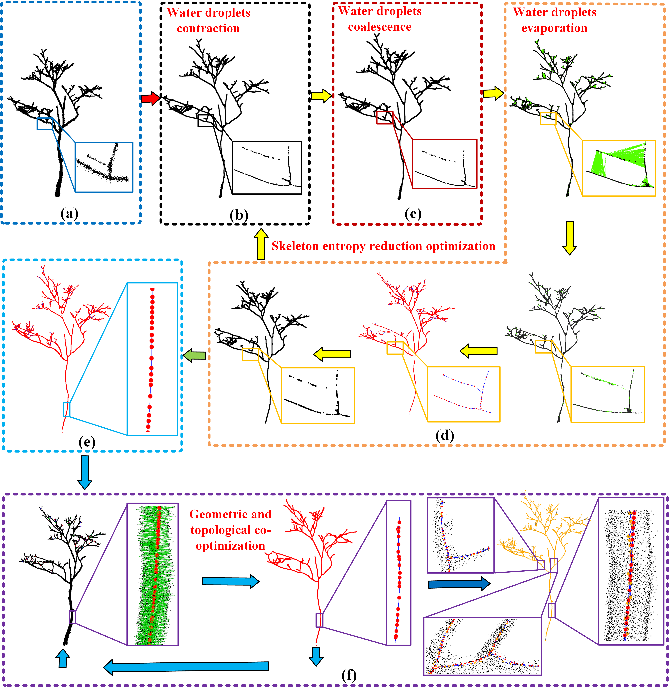

# WDTS
WDTS: Water Droplet Model-Driven Entropy Optimization for Individual Tree Skeletonization from Terrestrial Laser Scanning Point Clouds

 The code is currently being organized and will be uploaded in the near future
