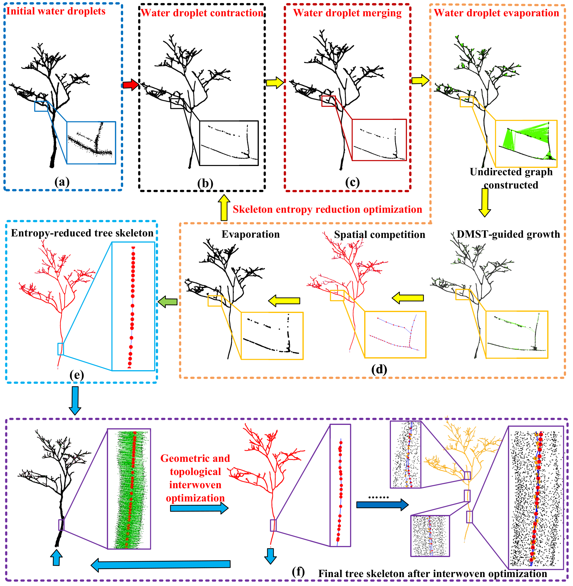

# WDTS: Water Droplet Model-Driven Entropy Optimization for Individual Tree Skeletonization from Terrestrial Laser Scanning Point Clouds

## Abstract

Individual tree skeletonization is a fundamental task in forestry remote sensing, which serves as a crucial prerequisite for various downstream applications, ranging from tree structural parameter estimation to carbon cycle modeling. Nevertheless, most existing skeletonization approaches struggle to generate a compact, centered tree skeleton while preserving detail fidelity and topological rationality. To this end, this paper proposes a water droplet model-driven entropy optimization approach (WDTS) to extract individual tree skeletons from Terrestrial Laser Scanning (TLS) point clouds. WDTS models an individual tree TLS point cloud as a system of water droplets with varying masses, by progressively generating the skeleton through simulated droplet contraction, merging, and evaporation processes. Key to our approach is an entropy reduction framework that progressively drives droplets toward compact skeletons. To further enhance the centeredness of the generated tree skeleton, WDTS employs a geometric and topological interwoven optimization strategy, explicitly aligning the skeleton within the center of the branch point clouds by minimizing the sum of the squared residuals. Experiments conducted on three individual tree TLS point cloud datasets with different data acquisition strategies have demonstrated the effectiveness and robustness of the proposed WDTS. Compared with previous methods, especially the state-of-the-art Dijkstra-enhanced L1-medial method, WDTS remarkably improves the compactness and centeredness of the skeletons with well-preserved local branch details, reducing the averaged MAE by 0.011m, 0.002m, and 0.030m on the single-scan, multi-scans, and simulated dataset, respectively. The generated tree skeletons including not only the tree skeleton points but also topologically coherent edges provide a robust foundation for downstream tasks, including precise tree geometry modeling, biomass estimation, and forestry-related sustainable development applications. 

---

## Pipeline



---

## Environment Setup

To run WDTS, you should first create a conda environment named `wdts` with Python 3.8, then activate it and install the required dependencies.

```bash
conda create -n wdts python=3.8 -y
conda activate wdts
pip install -r requirements.txt
```

---

## Usage

*(Below is a preliminary guide for the currently available modules. Full pipeline instructions will be added soon.)*

### 1. Interwoven Optimization
To run the currently available interwoven geometric and topological optimization on a preliminary skeleton:

```bash
python run_interwoven_optimization.py \
  --input_pc data/sample_tree.las \
  --input_skeleton data/sample_tree_init_skel.ply \
  --output results/optimized_skeleton.ply
```

### 2. Full Pipeline (Coming Soon)
Once the skeletonization module is uploaded, you will be able to run the end-to-end pipeline using:

```bash
python main.py --config configs/default.yaml --input data/sample_tree.las
```

---

## Citation

If you find our work, methodology, or code useful in your research, please consider citing our paper. 

**Note:** The manuscript is currently **under review** at the *ISPRS Journal of Photogrammetry and Remote Sensing*. The citation will be updated once accepted.

```bibtex
@article{wdts_under_review,
  title={WDTS: Water Droplet Model-Driven Entropy Optimization for Individual Tree Skeletonization from Terrestrial Laser Scanning Point Clouds},
  author={Anonymous},
  journal={ISPRS Journal of Photogrammetry and Remote Sensing},
  year={Under Review}
}
```
